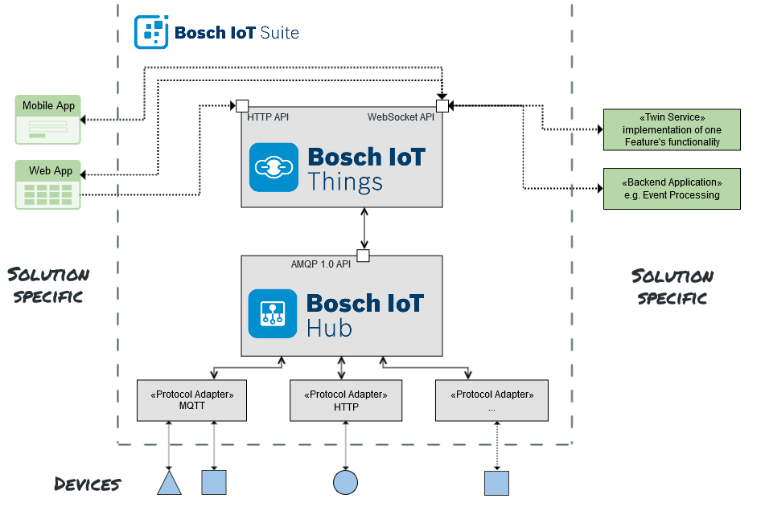

This repository contains documentation and examples on how to communicate via Bosch IoT Hub to Bosch IoT Things.

The Bosch IoT Suite is built on several services, two of them having the role of connecting devices and providing APIs
(utilizing the digital twin pattern) in order to interact with devices.

* the [Bosch IoT Hub](http://docs.bosch-iot-hub.com) provides means to *connect devices* through various protocols to 
  applications in the Internet of Things in a secure, reliable and elastic scaling manner.
* [Bosch IoT Things](https://things.s-apps.de1.bosch-iot-cloud.com/dokuwiki/doku.php?id=001_learn_about_cr:001_learn_about_cr)
  enables applications to *manage digital twins* of their IoT device assets in a simple, convenient, robust, and secure way.

Please follow the links above for detailed documentation of both of the services.

For an overview of relevant tutorials for BCX18, head over to the [BCX18 tutorials](https://preview.bosch-iot-suite.com/tutorials/).


## Hub - Things integration

We're at Bosch are team players and also our Bosch IoT Suite services play together in order to add even more value than
when using them alone. 



The picture shows that `south` of the Bosch IoT Hub real world devices are connected via various IoT protocols for which
the Hub provides protocol adapters.

`North` of the Hub the Bosch IoT Things service connects via the Hub's AMQP 1.0 interface in order to consume telemetry
data from the Hub.

`West` and `east` of Bosch IoT Things "solution specific" applications can access the Things APIs 
(HTTP and WebSocket) in order to interact with the **digital twins** of the connected devices. Via a WebSocket or 
Server-Sent-Events your applications can for example be notified about changes of connected devices.


## Connect your own devices

You can connect your own devices in this setup by connecting to one of the Bosch IoT Hub protocol adapters.

Following steps are necessary for that:
1. create a [Thing Type](https://preview.bosch-iot-suite.com/tutorials/dx_create_thingtype/) via 
   [Eclipse Vorto](https://eclipse.org/vorto) for your device describing its data and capabilities in order to have
   type information for your device
2. register your device in the Bosch IoT Suite via the [Developer console](https://console-bcx.bosch-iot-suite.com): 
   [tutorial](https://preview.bosch-iot-suite.com/tutorials/dx_register_device/)
3. choose a protocol (MQTT or HTTP) your device is capable to speak
    1. alternatively, if your device is not powerful enough to do HTTP or MQTT directly, use a gateway (e.g. a RaspberryPi)
       as an intermediate connecting your device
4. configure the endpoint to use
    1. for HTTP: `https://rest.bosch-iot-hub.com/telemetry/BCX18/<your-device-id>`
    2. for MQTT: `mqtt.bosch-iot-hub.com` - topic: `telemetry/BCX18/<your-device-id>`
5. whenever data changes on your device, send a message to either the HTTP endpoint or via the MQTT topic in 
   [Ditto Protocol](https://www.eclipse.org/ditto/protocol-specification.html) - [here you can find](https://www.eclipse.org/ditto/protocol-examples.html)
   some example Ditto Protocol messages
   
As a starting point you can also let the [Developer console](https://console-bcx.bosch-iot-suite.com) generate an example
as starting point, have a look at the [tutorials](https://preview.bosch-iot-suite.com/tutorials/) for that.


### HTTP example

Here a simple bash/cURL example on how to send data in [Ditto Protocol](https://www.eclipse.org/ditto/protocol-specification.html)
via the Bosch IoT Hub HTTP adapter:

```bash
DEVICE_ID='the-device-id'
AUTH_INFO=$(echo -n "$DEVICE_ID@BCX18:the-password" | base64) 
curl -v -X PUT https://rest.bosch-iot-hub.com/telemetry/BCX18/$DEVICE_ID \
    -H "Content-Type: application/json" \
    -H "Authorization: Basic $AUTH_INFO" \
    -d "{
          'topic': 'BCX18/$DEVICE_ID/things/twin/commands/modify',
          'headers': { 'response-required': false },
          'path': '/features/location/properties/status',
          'value': {
            'latitude': 52.5250840,
            'longitude': 13.3694020
          }
        }"
```

Use the password you provided when you created the device in the [Developer console](https://console-bcx.bosch-iot-suite.com).


## MQTT example

And a simple MQTT example (via `mosquitto_pub` which you can install on Ubuntu by `sudo apt install mosquitto-clients`)
on how to send data in [Ditto Protocol](https://www.eclipse.org/ditto/protocol-specification.html)
via the Bosch IoT Hub MQTT adapter:

```bash
curl -o iothub.crt http://docs.bosch-iot-hub.com/cert/iothub.crt

DEVICE_ID='the-device-id'
mosquitto_pub -h mqtt.bosch-iot-hub.com -p 8883 --cafile iothub.crt \
    -u $DEVICE_ID@BCX18 -P the-password -i $DEVICE_ID \
    -t telemetry/BCX18/$DEVICE_ID -d \
    -m "{
          'topic': 'BCX18/$DEVICE_ID/things/twin/commands/modify',
          'headers': { 'response-required': false },
          'path': '/features/location/properties/status',
          'value': {
            'latitude': 52.5250840,
            'longitude': 13.3694020
          }
        }"
```


Further documentation on the protocol adapters can be found in the 
[getting started of Bosch IoT Hub](http://docs.bosch-iot-hub.com/userguide/gettingstarted.html).
